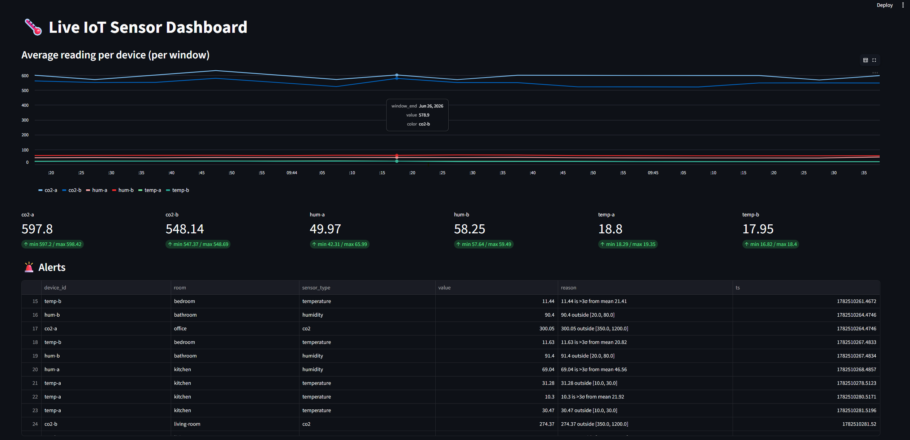
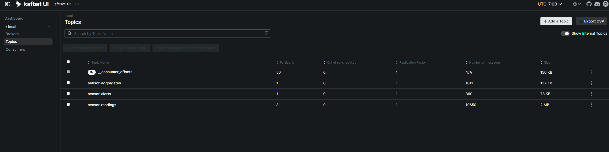

# kafka-practice — Real-time IoT Sensor Streaming

A complete, end-to-end streaming application for learning [Apache Kafka](https://kafka.apache.org/)
with Python. Simulated IoT sensors stream readings into Kafka; a stateful stream
processor computes windowed aggregates and detects anomalies; a live Streamlit
dashboard visualizes the results — all observable through a web Kafka UI.

It runs a modern **KRaft** broker (no Zookeeper) and demonstrates the core Kafka
concepts hands-on: topics, partitions, keyed ordering, consumer groups, offsets,
topic-to-topic stream processing, and consumer lag.

## Dashboard



The Streamlit dashboard shows per-device windowed averages (one line per sensor),
the latest value and min/max for each device, and a live feed of anomaly alerts —
all updating in real time as the processor emits to the derived topics.

## Kafka UI



The web Kafka UI (http://localhost:8080) is your X-ray into the cluster. The Topics
view above shows the three topics with their intentional partition counts
(`sensor-readings` = 3, the derived topics = 1) and live message counts. The
**Consumers** view shows each group, which partitions its members own, and their lag.

## Architecture

```
┌──────────────────┐    ┌──────────────────┐    ┌───────────────────────┐    ┌─────────────┐
│ sensor_simulator │    │ sensor-readings  │    │   stream_processor    │    │  dashboard  │
│   (PRODUCER)     │───►│  topic, 3 parts  │───►│ (CONSUMER + PRODUCER)  │─┬─►│ (CONSUMER)  │
│ 6 fake devices   │    │   raw readings   │    │ group: sensor-processor│ │  │ group:      │
│ keyed by device  │    │                  │    │ windows + anomalies    │ │  │ dashboard   │
└──────────────────┘    └──────────────────┘    └───────────────────────┘ │  └─────────────┘
                                                          │                 │
                                                          ▼                 │
                                                 ┌────────────────────┐     │
                                                 │ sensor-aggregates  │─────┤
                                                 │ sensor-alerts      │─────┘
                                                 │  (derived topics)  │
                                                 └────────────────────┘

           Kafka UI (http://localhost:8080) observes all topics, consumer groups & lag
```

Data only ever flows **through topics** — the scripts never talk to each other
directly. Each script is a Kafka *client* connecting to the broker (the *server*)
via the bootstrap address `localhost:29092`.

## What each Kafka concept maps to

| Concept | Where it lives |
| --- | --- |
| Producer / client / server | `producer/sensor_simulator.py` → broker |
| Keyed partitioning + per-key ordering | `key=device_id` pins a device to one partition |
| Topics as durable, replayable buffers | `sensor-readings` (3 partitions) |
| Consumer groups, offsets, rebalancing | group `sensor-processor` |
| Manual offset commit (at-least-once) | `enable_auto_commit=False` + `consumer.commit()` |
| Stateful stream processing (tumbling windows) | per-device buckets in the processor |
| Topic-to-topic pipelines (derived streams) | `sensor-aggregates`, `sensor-alerts` |
| Independent consumer groups (pub/sub) | group `dashboard` reads the same data separately |
| Observability (consumer lag) | Kafka UI |

## Requirements

- [Docker](https://docs.docker.com/get-docker/) and Docker Compose
- Python 3.10+

## Setup

1. **Start the broker and Kafka UI:**

   ```bash
   docker compose up -d
   docker compose ps          # both 'kafka' and 'kafka-ui' should be Up
   ```

   Open the Kafka UI at **http://localhost:8080** (cluster `local`).

2. **Install Python dependencies:**

   ```bash
   python -m venv .venv
   source .venv/bin/activate          # Windows: .venv\Scripts\activate
   pip install -r requirements.txt
   ```

3. **Create the topics** (with intentional partition counts):

   ```bash
   python create_topics.py
   ```

   Confirm in Kafka UI → Topics: `sensor-readings` (3 partitions),
   `sensor-aggregates` (1), `sensor-alerts` (1).

## Running the pipeline

Run each stage in its own terminal (with the venv activated):

```bash
# Terminal 1 — produce simulated sensor readings
python producer/sensor_simulator.py

# Terminal 2 — consume, aggregate, detect anomalies
python processor/stream_processor.py

# Terminal 3 — live dashboard
streamlit run dashboard/app.py
```

Then watch:
- the **dashboard** (opens in your browser) — per-device charts and a live alert feed
- **Kafka UI** (http://localhost:8080) — messages flowing on all three topics and the
  `sensor-processor` group keeping up with low lag

## Experiments (the best way to learn)

Open Kafka UI alongside these:

1. **Rebalancing** — start a *second* `stream_processor.py`. The 3 partitions split
   across the two group members. Stop one → they merge back.
2. **Parallelism ceiling** — run 4 processors. Only 3 get a partition; the 4th sits idle
   (partitions cap parallelism).
3. **Consumer lag** — stop the processor for ~30s while the producer runs; watch lag climb,
   then drain on restart. No data is lost — Kafka stored it all.
4. **Replay** — change the dashboard's `group_id` to a new name; a fresh group re-reads the
   topic history from the beginning (`auto_offset_reset="earliest"`).
5. **Keys & ordering** — remove `key=dev` in the producer; readings scatter across all
   partitions and lose per-device ordering. Put it back to restore order.

## Configuration

All shared settings live in [`config.py`](config.py) — bootstrap address, topic names,
partition counts, the tumbling-window size (`WINDOW_SECONDS`), the simulated device fleet,
and per-sensor anomaly thresholds. Change them in one place and every stage picks them up.

## Project layout

```
kafka_practice/
├── docker-compose.yml          # KRaft Kafka broker + Kafka UI
├── config.py                   # shared settings (single source of truth)
├── create_topics.py            # idempotent topic creation
├── requirements.txt
├── producer/
│   └── sensor_simulator.py     # PRODUCER: fakes 6 IoT devices, keyed by device_id
├── processor/
│   └── stream_processor.py     # CONSUMER+PRODUCER: windowed aggregates + anomaly alerts
├── dashboard/
│   └── app.py                  # CONSUMER: live Streamlit dashboard
├── practice/                   # standalone Python drills for patterns used above
│   ├── warmup.py               #   tuple unpacking + dict.items()
│   ├── core.py                 #   defaultdict
│   └── stretch.py              #   deque (the rolling-history pattern)
└── basics/                     # original "Kafka 101" reference
    ├── producer.py             #   keyed producer
    ├── consumer.py             #   consumer in a group
    └── consumer2.py            #   second consumer to show rebalancing
```

## Cleanup

```bash
docker compose down            # stop containers
docker compose down -v         # also remove volumes (wipes all topic data)
```

## Notes

- The client library is **kafka-python**; KRaft is broker-side only, so client code is
  unaffected by the move off Zookeeper.
- The processor uses **processing-time** tumbling windows for clarity. Event-time windowing
  (bucketing by each reading's own `ts`) is a natural next extension.
